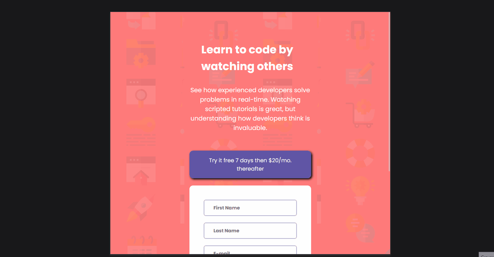

<h1 align="center">Intro component with sign up form</h1>

  Projeto do Front-End Mentor para praticar HTML e CSS.

 

  

## 🚀 Tecnologias

Esse projeto foi desenvolvido com as seguintes tecnologias:

- HTML e CSS(Responsividade)
- Git e Github

## 💻 Projeto

Uma landing page para praticar o conceito de form. *No futuro irei validar os inputs com JavaScript.*

## Como ficou o projeto online

  

   
   

  

  
<a href="https://intro-component-with-sign-up-form-lilac-two.vercel.app/" target="_blank">Clique aqui</a> para acessar o site do projeto

## 🔖 Layout

Você pode visualizar o site do Front-End Mentor cliando [aqui](https://www.frontendmentor.io/challenges/intro-component-with-signup-form-5cf91bd49edda32581d28fd1").

